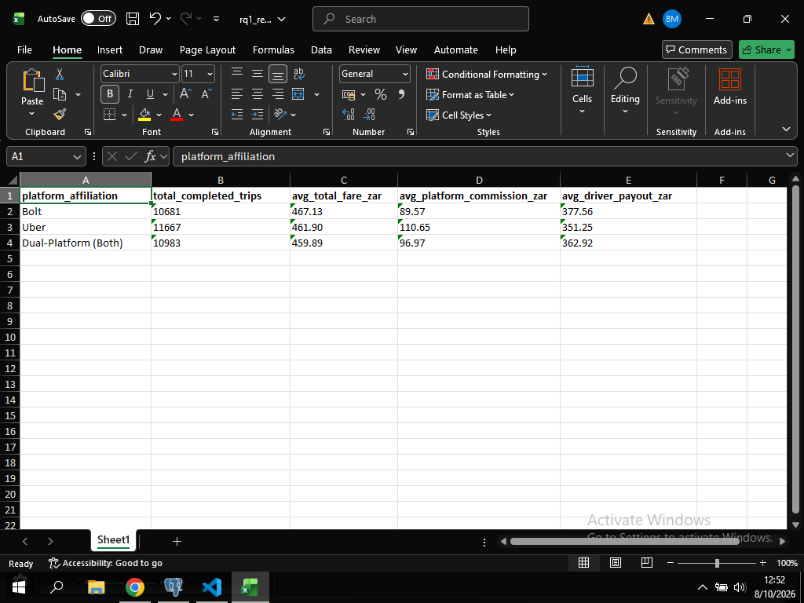

# RQ1 – Analysis

## Research Question

How do average total fares, platform commisions and driver payouts differ between Uber, Bolt and Dual-Platform drivers?

## Purpose
This research question compares Uber, Bolt, and Dual-Platform (Both) drivers using completed trips. It measures the average total fare charged to riders, the average platform commission retained, and the average payout paid to drivers. Cancelled and non-completed trips are excluded because they do not represent paid rides and fare breakdown is only valid for completed trips.The driver-level breakdown is:
- total_fare_zar: total amount rider paid
- platform_commission_zar: amount platform keeps
- driver_payout_zar: amount driver receives (total_fare - commission - fees + tip)

Two metrics are reported to make the comparison explicit:
- Average fare metrics: the arithmetic mean (average) of fares, commissions and payouts per platform, each trip has equal weight.
- Total trips: count of completed trips per platform to show market share.

The analysis uses sa_drivers joined to trip_headers joined to trip_fare_breakdown. The SQL also uses an INNER JOIN to ensure only drivers with trips are counted. The read-only transaction protects the database while the report queries run.

## SQL Query

See `02_SQL_Queries/RQ1.sql`.

## Results

## Analysis

1. Bolt has the highest avg total fare (R467.13) vs Uber (R461.90) vs Both (R459.89)
2. Uber retains highest commission (R110.65) vs Bolt lowest (R89.57)
3. Because of lower commission, Bolt drivers get highest payout (R377.56) vs Uber lowest (R351.25)

## Conclusion

Platform affiliation directly affects earnings. Bolt is most favorable per trip for driver payout in this dataset.

## Visualisation

[Add a suitable chart or table if required.]
